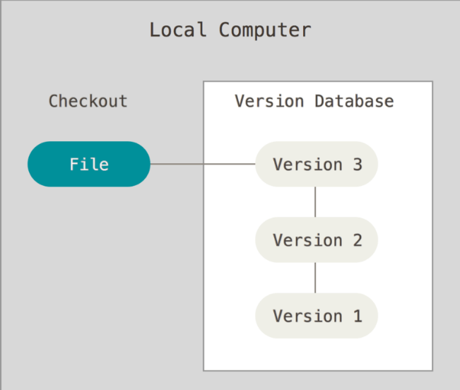
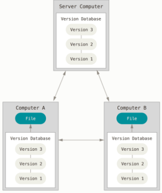

# Opening
Hallo guys, kali ini kita akan belajar menggunakan VCS Video Call Sange :v ..eh..bukan bukan ...VCS(Version Control System). langsung saja no basa basi...karena muka anda sudah basi :v


# Requirement
 * Sehat
 * Memiliki Otak
 * Dapat berfikir
 * Tidak sedang gila
 * Dapat mengoperasika komputer
 * dan yang terpenting **BUKAN ORNAG ISRAEL**

# A. Pendekatan Version Control
## -> Mengelaola Versi FIle
Saat kita mengerjakan Skripsi atau Tesis di universitas Sering kali kita akan mendapatkan revisi setelah di periksa oleh dosen pembimbing, hal yang biasanya kita lakukan yaitu melakukan copy file skripsi veris 1 dan kita paste file skripsi versi 1 tersebut menjadi versi 2 dan kita akan melakukan perbaikan pada skripsi tersebut.  

saat kita ajukan kempali kepada dosen pembimbing ternyata masih ada revisi, maka yang kita lakukan adalah melakukan copy pada skripsi/tesis versi 2 dan paster menjadi skirpsi/tesis versi 3 dan kita akan melakukan perbaikan.  

Dan saat kita ajukan kembali skrpsi versi 3 tersbut ternyata perbaikan yang kita lakukan di versi 3 tidak relavan dengan konteks skripsinya, dan hal yang kita lakuka tentusaja akan kembali mengerjakan skripsi yang versi 2.
  
Tujuan melakukan copy file sebelumnya dan mempaste dengan nama dengan versi terbaru bertujuan untuk berjaga-jaga jikalau perubahan di file yang tidak sesuai.  
  
Jika kita perhatikan, cara tersebut bukanlah cara yang efisien, dan kita perlu ketahui juga menejemen versi seperti itu bukanlah menejean yang baik. Oleh karna itu lahirlah VCS(Version Control System) yang berfungsi untuk melakukan versioning suatu file.

## -> VCS (Version Control System)
VCS atau Verson Control System adalah sebuah software atau system yang akan melakukan tracking atau merekam perubahan yang terjadi pada file.  
  
File disini tidak hanya file txt atau file pemrograman, namun bisa juga file gambar, grafik, layout dan sebagainya kesemuanya file tersebut dapat di rekam oleh git.  

Oleh karna itu kita dapat melakuakn versioning dengan mudah, evisien, dan tetunya kita bisa melakukan menejeman verison yang baik.  

Reference : https://git-scm.com/book/id/v2/Memulai-Tentang-Version-Control
## -> Jenis-jenis Version Control
* **Local Version Control**  
Version Control ini berjalan hanya di local computer, pendekatan Version Control ini sangat sederhana karena tidak membutuhkan server, namun perlu di ketahui bahwa pendekatan ini rentan terhadap error

Semua riwayat perubahan pada file akan disimpan di local computer.
* **Centralized Version Control**
Saat kita menggunakan Local Version Control, permasalahan yang sering muncul yaitu berkas yang tidak high availabelity, artinya jikalau komputer yang digunakan untuk mentimpan riwayat perubahan tersebut rusak maka seluruh riwayat dan versioning nya akan hilang.  

  Selain itu kita juga akan sulit berkolaborasi karena file dan riwayat perbahanya berada di 1 komputer

  Untuk mengatasi hal tersebut kita bisa menggunakan Centralized Version Control, Version Control jenis ini menggunakan server untuk menyimpan riwayat perubahan file nya, jadi penggunakan Centralized Version Control ini lumayan High Avallabelity, artinya ketersediaan nya lumayan bagus karena semua riwayat tersimpan didalam server.  
  
  Namun kekurangan Centralized Version Control ini kita hanya bisa melihat riwayat perubahan jikalau kita online, dan jikalau servernya mati maka semua orang tidak dapat melihat riwayat perubahan.

  
* **Distributed Version Control(DVC)**  
  Dalam DVC ini semua riwayat perubahan akan di simpan di server dan local computer, jadi seluruh riwayat yang disimpan di server akan di copy di local computer.

  Keuntungan menggunakan DVC ini sangatlah banyak diantaranya yaitu high avalilability riwayat perubahan, saat server down client atau local computer tetap dapat melakuakn versioning dan sebagainya. 

  Contoh DVC diantaranya yaitu Git, Mercurial dan masih banyk lagi, namun pembahasan kali ini akan fokus pada GIT.

  

Reference : https://git-scm.com/book/id/v2/Memulai-Tentang-Version-Control

# Sejarah GIT
Git muncul dilatarblakangi oleh project opensource kernel Linux Linus Torvalds. Pada tahun 1991 - 2002 kernel Linux di kembangkan dengan memanfaatkan patch dan archive file, hal tersebut sangatlah ribet dan tidak efisien.  
pada tahun 2002 Linus Torvalds mulai menggunakan DVCS(Distributed Version Control System) yang bernama BitKeeper namun pada tahun 2005 Perusahaan pemilik BitKeeper dengan komunitas Linux Linus Torvalds kurang baik. Singkat cerita karena hubungan kedua pihak kurang baik Linus Torvalds memutuskan untuk membuat Software DVCS sendiri yang dinamai GIT.  
Git pertama kali di kenalkan oleh Linus Torvalds pada tahun 2005, dan karena git sangat ringan, stabil, cepat, sangat baik dalam menejemen project berukuran besar, git secara signifisikan sangat populer bahkan melebihi kepopuleran BitKeeper.  

Refrence : https://git-scm.com/book/id/v2/Memulai-Sejarah-Singkat-Git

# Install Git
Git tersedia di banyak sistem operasi Mac, Linux, Windows.  
kita bisa mendownload git dari https://git-scm.com/downloads  
dan sesuaikan degan sistem operasi temen-temen.  
  
Untuk pengguna windows setelah menginstall git dari Instaler yang di download maka akan memiliki applikasi yang namanya gitBash. Nah di applikasi ini nanti kita akan menggunakan Git.

# Configuration
Setelah berhasil menginstall Git, Hal wajib pertama yang harus kita lakukan yaitu melakukan setting username dan email pada Git.  
Kita dapat melakukan config userame nya dengan menggunakan command berikut ini :
```sh
git config --global user.name "alliano-dev"
```
Untuk melakukan setting email nya :
```sh
git config --global user.email "allianoanonymous@gmail.com"
```
